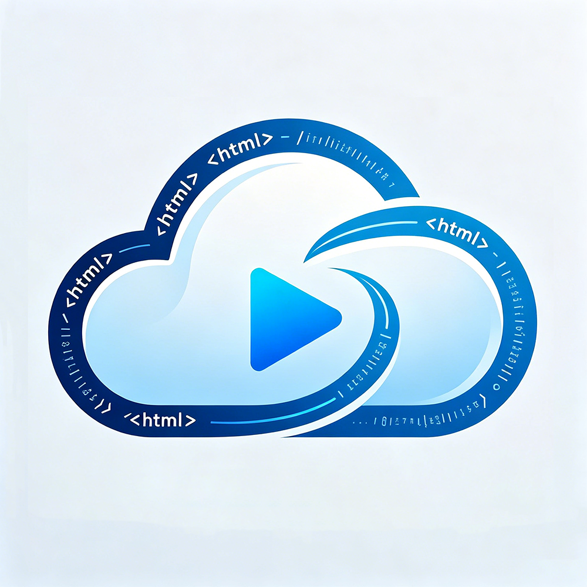

# Html To Video Pixie

<div align="center">



**AI Video Generation Tool**

Describe your video needs in natural language, AI generates HTML/CSS animation, one-click render to MP4 video or GIF.

[](LICENSE)
[](https://www.python.org/)
[]()

</div>

## ✨ Features

- 🎯 **AI Chat Generation** - Natural language input, AI understands and generates animation code
- 🌐 **Bilingual UI** - Support Chinese/English interface switching
- 🤖 **Multi-Model Support** - Compatible with OpenAI, DeepSeek, Xiaomi MiMo and other providers
- 🎨 **Real-time Preview** - WYSIWYG, streaming HTML/CSS animation code output
- 🎬 **Video Export** - Support MP4 and GIF formats
- 💾 **Creation Management** - Auto-save creations, import/export HTML
- 💬 **Chat Management** - Save/load/delete chat history with multi-turn context

## 🚀 Quick Start

### Option 1: Installer (Recommended)

1. Download `HtmlToVideoPixieInstaller.exe`
2. Double-click to run installer
3. Select install directory (default `C:\Program Files\HtmlToVideoPixie\`)
4. Check to create desktop/start menu shortcuts
5. Click "Install"

### Option 2: Run from Source

```bash
# Clone project
git clone https://github.com/FatFatYoung/HtmlToVideoPixie.git
cd HtmlToVideoPixie

# Install dependencies
pip install requests playwright pillow
playwright install

# Run program
python main_tkinter.py
```

## 🌐 Language Switch

After starting the program, click the language switch button in the top-right corner:
- Default English interface, button shows "简体中文"
- Click to switch to Chinese interface, button becomes "English"

## ⚙️ Configure AI Provider

### In-App Configuration (Recommended)

1. Start program
2. Click **Model Settings**
3. Click **Add Provider**
4. Fill in provider info:
   - Name: Custom name
   - API URL: Provider's API endpoint
   - API Key: Your API key
   - Model ID: Model name to use
5. Click **Save**

### Supported Providers

| Provider | API URL | Model Examples |
|--------|---------|----------|
| OpenAI | `https://api.openai.com/v1` | gpt-4-turbo, gpt-3.5-turbo |
| DeepSeek | `https://api.deepseek.com` | deepseek-chat |
| Xiaomi MiMo | `https://api.xiaomimimo.com/v1` | mimo-v2.5-pro |
| Tongyi Qianwen | `https://dashscope.aliyuncs.com/compatible-mode/v1` | qwen-turbo |
| Zhipu AI | `https://open.bigmodel.cn/api/paas/v4` | glm-4-flash |

> All providers compatible with OpenAI format can be used

## 📖 Usage

### Basic Operations

| Operation | Description |
|------|------|
| **Enter** | Send message |
| **Ctrl+Enter** | New line |
| **Operation → New Chat** | Start new chat |
| **Operation → Import HTML** | Import HTML from local |
| **Operation → Creations** | View creations |
| **Operation → Chat History** | Load/delete chats |
| **Model Settings** | Add/edit providers |
| **Generate Video** | Choose MP4/GIF |

### Example

```
You: Generate an animation of the solar system with eight planets orbiting the sun
AI: [Thinking...]
AI: [Creating...]
AI: [Creation completed]
    Video settings dialog will pop up automatically
```

## 🛠️ Architecture

```
User Input (Natural Language)
        ↓
   tkinter Dialog Interface
        ↓
   AI API (Streaming SSE)
        ↓
   HTML/CSS Animation Code
        ↓
   Auto Video Settings Dialog
        ↓
   Playwright (Edge/Chrome Rendering)
        ↓
   FFmpeg Encoding
        ↓
   MP4 / GIF Output
```

## 📁 Project Structure

```
HtmlToVideoPixie/
├── main_tkinter.py         # Main entry
├── core/
│   ├── ai_client.py        # AI Client
│   ├── video_generator.py  # Video Generator
│   └── i18n.py             # Internationalization
├── config/
│   └── providers.json      # Provider Config
├── data/                   # Creations/Chats
├── output/                 # Video Output
├── temp/                   # Temp Files
├── logo.png                # Project Logo
├── logo.ico                # App Icon
├── installer.py            # Installer
├── build_installer.bat     # Build Script
├── LICENSE                 # MIT License
└── README.md
```

## 🔧 Requirements

| Component | Requirement |
|------|------|
| Python | 3.10+ (for source code) |
| FFmpeg | Bundled in installer |
| Browser | Edge or Chrome (Playwright) |
| AI Provider | API Key required |

## 📦 Build Installer

```bash
# Install build dependencies
pip install pyinstaller

# Prepare FFmpeg
# Place ffmpeg.exe in project root

# Run build script
build_installer.bat

# Output: installer_build/HtmlToVideoPixieInstaller.exe
```

## 📄 License

This project is licensed under the [MIT License](LICENSE).

### Third-Party Licenses

| Library | License | Copyright |
|----|--------|------|
| requests | Apache 2.0 | Copyright 2019 Kenneth Reitz |
| playwright-python | Apache 2.0 | Copyright 2011-2024 Microsoft Corporation |
| Pillow | HPND | Copyright 1997-2024 Alex Clark and contributors |
| FFmpeg | LGPL/GPL | Copyright 2000-2024 FFmpeg developers |

See [LICENSE](LICENSE) file for details.

## 👤 Author

- **FatFatYoung**
- GitHub: [@FatFatYoung](https://github.com/FatFatYoung)
- Project: [Html To Video Pixie](https://github.com/FatFatYoung/HtmlToVideoPixie)

---

<div align="center">

**If you find this useful, please give a ⭐ Star!**

</div>
